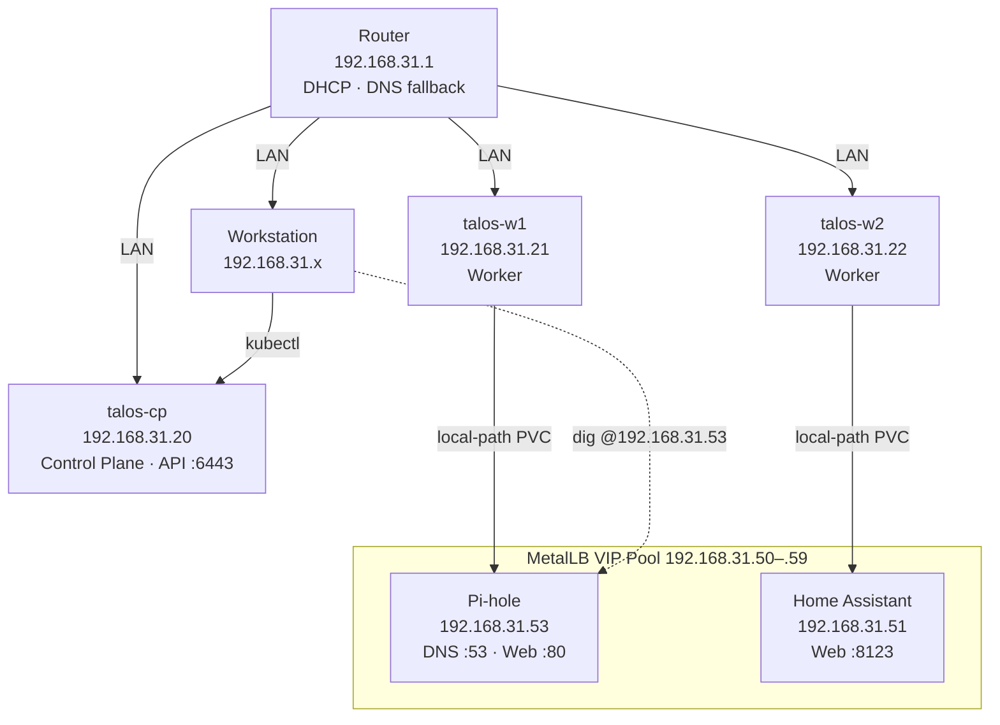
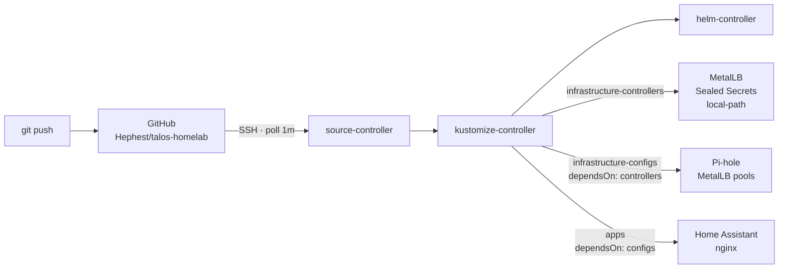
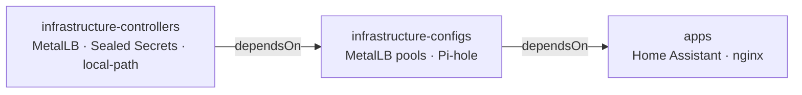

# talos-homelab

A 3-node bare-metal Kubernetes homelab running [Talos OS](https://www.talos.dev/), fully managed via GitOps with [Flux CD](https://fluxcd.io/). Infrastructure is declared as code in this repository; a `git push` is all it takes to add or change anything in the cluster.

---

## Hardware

| Node | Role | IP | Hardware |
|------|------|----|----------|
| `talos-cp` | Control Plane | `192.168.31.20` | Dell OptiPlex |
| `talos-w1` | Worker | `192.168.31.21` | Dell OptiPlex |
| `talos-w2` | Worker | `192.168.31.22` | Dell OptiPlex |

- **LAN:** `192.168.31.0/24`, gateway `192.168.31.1`
- **MetalLB VIP pool:** `192.168.31.50–.59` (must be excluded from router DHCP)

---

## Network Topology



---

## Software Stack

| Component | Version | Namespace | Endpoint |
|-----------|---------|-----------|----------|
| Talos OS | v1.13.3 | — | — |
| Kubernetes | v1.36.1 | — | `https://192.168.31.20:6443` |
| Flannel (CNI) | bundled | `kube-system` | — |
| Flux CD | v2.8.8 | `flux-system` | — |
| Sealed Secrets | latest | `kube-system` | — |
| local-path-provisioner | v0.0.31 | `local-path-storage` | default StorageClass |
| MetalLB | v0.16.1 | `metallb-system` | pool `192.168.31.50–.59` |
| Pi-hole | chart 2.35.0 | `pihole` | `192.168.31.53` :53/:80 |
| Home Assistant | stable | `home-assistant` | `192.168.31.51:8123` |

---

## GitOps Architecture

All cluster state is reconciled from this repository. Flux polls the GitHub repo every minute via an SSH deploy key and applies changes automatically.



### Kustomization Dependency Chain



### Repository Layout

```
talos-homelab/
├── clusters/homelab/          # Flux entrypoint — three top-level Kustomizations
│   ├── flux-system/           # Flux controller manifests (auto-generated at bootstrap)
│   ├── infrastructure-controllers.yaml
│   ├── infrastructure-configs.yaml
│   └── apps.yaml
├── infrastructure/
│   ├── controllers/           # MetalLB, Sealed Secrets, local-path-provisioner
│   └── configs/               # MetalLB pools, Pi-hole HelmRelease + SealedSecret
├── apps/
│   ├── homeassistant/         # Home Assistant StatefulSet + Services
│   └── nginx.yaml             # Demo app (GitOps smoke test)
├── config/                    # Talos machine configs — GITIGNORED (contain cluster keys)
├── infra/                     # Pre-Flux bring-up reference (kept as migration record)
└── docs/
    └── master-plan.md         # Original implementation roadmap
```

---

## From-Scratch Setup Guide

### Prerequisites

```bash
brew install siderolabs/tap/talosctl kubectl fluxcd/tap/flux kubeseal helm gh
```

### 1 — Generate Talos secrets and node configs

```bash
mkdir -p config
talosctl gen secrets -o config/secrets.yaml

# Replace <CP_IP> and <LB_IP> with your values
talosctl gen config talos-cluster https://<CP_IP>:6443 \
  --with-secrets config/secrets.yaml \
  --output-dir config

# Edit config/controlplane.yaml: set static IP, hostname, gateway, DNS
# Edit config/worker.yaml: duplicate for each worker, set per-node IP/hostname
```

Key settings in `controlplane.yaml`:
```yaml
machine:
  network:
    hostname: talos-cp
    interfaces:
      - deviceSelector:
          physical: true
        addresses: ["192.168.31.20/24"]
        routes: [{network: "0.0.0.0/0", gateway: "192.168.31.1"}]
        dhcp: false
  kubelet:
    extraMounts:
      - destination: /var/mnt
        type: bind
        source: /var/mnt
        options: [rbind, rshared]   # required for local-path-provisioner
cluster:
  controlPlane:
    endpoint: https://192.168.31.20:6443
  apiServer:
    certSANs: [talos-cp.lan, talos-cp, 192.168.31.20]
```

### 2 — Boot nodes from Talos ISO

Download the Talos ISO for your platform from [talos.dev/latest/talos-guides/install/](https://www.talos.dev/latest/talos-guides/install/) and boot each machine. Nodes start in maintenance mode.

### 3 — Apply configs and bootstrap

```bash
# Apply control plane config (--insecure = maintenance mode, no TLS yet)
talosctl apply-config --nodes 192.168.31.20 --file config/controlplane.yaml --insecure

# Bootstrap etcd (run once, on the control plane node only)
talosctl bootstrap --nodes 192.168.31.20 --talosconfig config/talosconfig

# Fetch kubeconfig
talosctl kubeconfig --nodes 192.168.31.20 --talosconfig config/talosconfig
```

### 4 — Join worker nodes

```bash
talosctl apply-config --nodes 192.168.31.21 --file config/worker1.yaml --insecure
talosctl apply-config --nodes 192.168.31.22 --file config/worker2.yaml --insecure

kubectl get nodes -w   # wait for all 3 nodes Ready
```

### 5 — Bootstrap Flux

Generate an SSH deploy key, add it to the GitHub repo (read-write), then bootstrap:

```bash
ssh-keygen -t ed25519 -f flux-deploy-key -N ""
gh repo deploy-key add flux-deploy-key.pub --title "flux" --allow-write

flux bootstrap git \
  --url=ssh://git@github.com/Hephest/talos-homelab.git \
  --path=clusters/homelab \
  --private-key-file=./flux-deploy-key
```

Flux will apply `clusters/homelab/` and reconcile the full dependency chain automatically.

### 6 — Seal secrets

Any secret that needs to live in the repo must be sealed with the in-cluster public key:

```bash
# Fetch the controller's public key
kubeseal --fetch-cert \
  --controller-name=sealed-secrets-controller \
  --controller-namespace=kube-system \
  > pub-cert.pem

# Seal a secret
kubectl create secret generic my-secret \
  --namespace my-namespace \
  --from-literal=password=hunter2 \
  --dry-run=client -o yaml \
  | kubeseal --cert pub-cert.pem --format yaml > my-sealedsecret.yaml

# Commit my-sealedsecret.yaml — the plain secret NEVER goes in git
```

### 7 — DNS cutover (optional but recommended)

Set your router's DHCP primary DNS to `192.168.31.53` (Pi-hole VIP) with a fallback (e.g. `1.1.1.1`). Then either renew your DHCP lease or set DNS directly on the Mac:

```bash
sudo networksetup -setdnsservers Wi-Fi 192.168.31.53 1.1.1.1
# Revert later with: sudo networksetup -setdnsservers Wi-Fi empty
```

Once `talos-cp.lan` resolves, switch kubeconfig to the hostname:

```bash
talosctl kubeconfig --nodes 192.168.31.20 --talosconfig config/talosconfig --force
```

---

## Adding a New Application

1. Create a directory under `apps/`:
   ```
   apps/
   └── myapp/
       ├── kustomization.yaml   # lists resources
       ├── namespace.yaml
       ├── deployment.yaml      # or statefulset.yaml
       └── service.yaml         # LoadBalancer if you need a VIP
   ```

2. Add the directory to `apps/kustomization.yaml`:
   ```yaml
   resources:
     - myapp
   ```

3. If the app needs a LoadBalancer VIP, pick an unused IP from `192.168.31.50–.59` and add a DNS record to `infrastructure/configs/pihole.yaml`:
   ```yaml
   dnsmasq:
     customDnsEntries:
       - address=/myapp.lan/192.168.31.5X
   ```

4. If the app needs a secret, seal it (see step 6 above) and commit only the `SealedSecret`.

5. `git push` — Flux reconciles within ~1 minute.

---

## Known Limitations & TODOs

See [TODO.md](TODO.md) for the full list. Key open items:

- **Single control plane:** `talos-cp` is a SPOF — no etcd HA. Mitigate with scheduled `talosctl etcd snapshot` backups.
- **Worker power recovery:** Workers (Dell OptiPlex) don't auto-power-on after AC loss — set BIOS *AC Power Recovery → On*.
- **DNS cutover:** Router + Mac not yet pointing at Pi-hole as primary DNS. Router DHCP change + DHCP lease renewal required.
- **Chart automation:** Chart versions are pinned; consider [Renovate](https://docs.renovatebot.com/) or Flux image-automation for automatic bumps.

---

## Talos-Specific Notes

- **Hostnames must be single DNS labels** — never use FQDNs (e.g. `talos.cp.local`) as the Talos hostname. Talos truncates to the first label and all nodes would collide on the same Kubernetes node name.
- **`/opt` is read-only** on Talos — use `/var/mnt` for persistent storage paths (mounted via kubelet `extraMounts`).
- **Cluster nodes use upstream DNS** (`192.168.31.1` / `8.8.8.8`), not Pi-hole, to avoid a boot dependency loop where pods can't start because DNS isn't up.
- **Flannel VTEP MAC uniqueness** — after any node-rename operation, verify each node has a unique `flannel.alpha.coreos.com/backend-data` annotation. Duplicate MACs silently break cross-node pod networking.
- **MetalLB service annotation conflict** — do not set both `spec.loadBalancerIP` and the `metallb.io/loadBalancerIPs` annotation on the same service; MetalLB rejects it.
